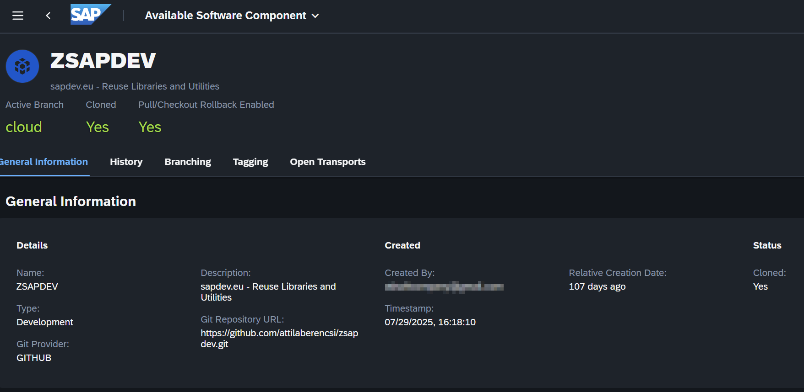
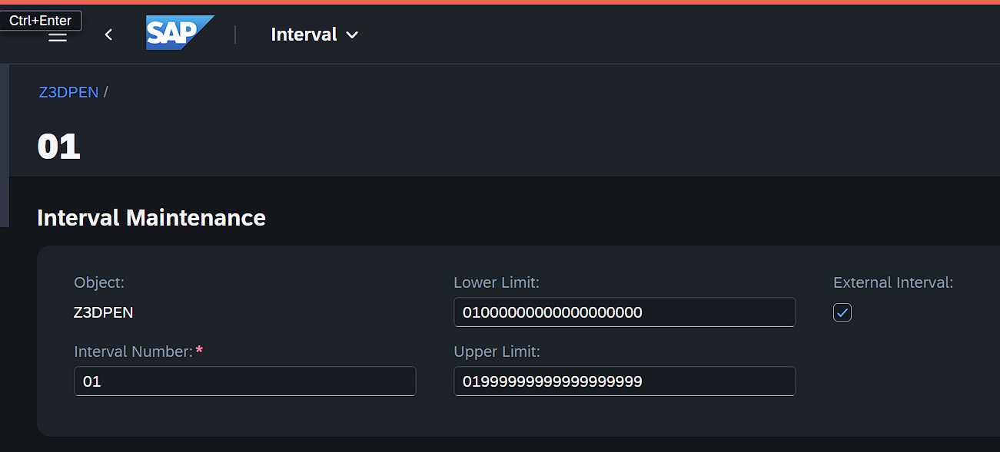
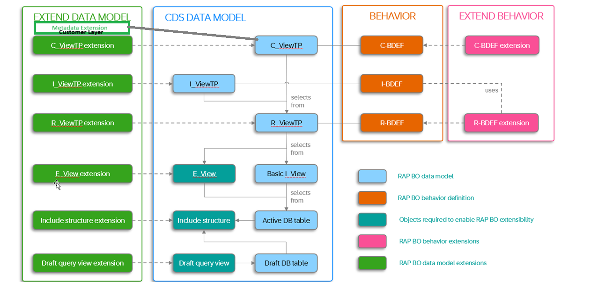

# sapdev.eu - ABAP RAP Reuse Libraries, Utilities and Samples

## 📚 Table of Contents

- [sapdev.eu - ABAP RAP Reuse Libraries, Utilities and Samples](#sapdeveu---abap-rap-reuse-libraries-utilities-and-samples)
  - [📚 Table of Contents](#-table-of-contents)
  - [Overview](#overview)
  - [Getting Started](#getting-started)
    - [Prerequisites](#prerequisites)
    - [Branch Installation](#branch-installation)
    - [Branch Information](#branch-information)
  - [Core Components](#core-components)
    - [RAP Utilities (`zsapdev_rap`)](#rap-utilities-zsapdev_rap)
  - [Sample Applications](#sample-applications)
    - [3D Printer Management - Draft (`zsapdev_rap_sample_3dp`)](#3d-printer-management---draft-zsapdev_rap_sample_3dp)
    - [3D Printer Management - Early Numbering (`zsapdev_rap_sample_3dp_en`)](#3d-printer-management---early-numbering-zsapdev_rap_sample_3dp_en)
    - [3D Printer Management - No Draft (`zsapdev_rap_sample_3dp_nd`)](#3d-printer-management---no-draft-zsapdev_rap_sample_3dp_nd)
    - [RAP Extensibility Enablement (`zsapdev_rap_sample_sap_bo`)](#rap-extensibility-enablement-zsapdev_rap_sample_sap_bo)
    - [RAP Developer Extensibility Provider (`zsapdev_rap_sample_sap_ext`)](#rap-developer-extensibility-provider-zsapdev_rap_sample_sap_ext)
    - [S/4HANA Side-by-Side Extension (`zsapdev_rap_sample_side_by_s4`)](#s4hana-side-by-side-extension-zsapdev_rap_sample_side_by_s4)
    - [Code Generation Sample (`zsapdev_rap_sample_codegen`)](#code-generation-sample-zsapdev_rap_sample_codegen)
    - [3D Print Materials \& Filaments (`zsapdev_sample_rap_3d_print`)](#3d-print-materials--filaments-zsapdev_sample_rap_3d_print)

---

## Overview

This repository contains reusable ABAP RAP (RESTful ABAP Programming) utilities, base classes, and comprehensive sample applications demonstrating various RAP patterns and scenarios.

## Getting Started

### Prerequisites

- ABAP Development Tools (ADT) in Eclipse

### Branch Installation

* Using abapGit (onPremise / BTP ABAP Environment)
  * Clone this repository to your system into package ZSAPDEV, use the corresponding branch
* Using Software Components (gCTS) on BTP ABAP Environment
  * cloud branch only
  * copy this repository manually to your own repository, or fork it: [https://github.com/attilaberencsi/zsapdev](https://github.com/attilaberencsi/zsapdev) but do not push back anything to my repo from your fork ⚠️
  * Using the Manage Software Component (F3562) Fiori Application, create a GitHub based Component / Package ZSAPDEV
    

### Branch Information

This repository maintains multiple branches for different system versions.

| Branch          | Target System         | Description                                                                           |
| --------------- | --------------------- | ------------------------------------------------------------------------------------- |
| `cloud`       | BTP ABAP Environment  | Cloud-optimized version with side-by-side extensions, Latest BAS Integration Features |
| `onPrem-2023` | On-Premise ABAP 7.56+ | On-premise version with full features including mandatory field validation            |

**Current Branch:** `cloud`

## Core Components

### RAP Utilities (`zsapdev_rap`)

A collection of reusable base classes and interfaces for managed RAP applications with draft handling.

**Features:**

- Managed draft handler base implementation (`zcl_sapdev_rap_managed_base`)
- Base interface for managed operations (`zif_sapdev_rap_managed_base`)
- Standardized error messaging (`zcm_sapdev_rap`) implements interface `if_abap_behv_message`
- Admin structure include (`zsapdev_s_rap_admin`)

**Status:**

- ✅ Draft handling: Available
- ⚠️ Mandatory field validation: In progress (available in `onPrem-2023` branch)
  [Developer Guide](https://www.sapdev.eu/rap-painless-mandatory-field-validation/) for mandatory field validation.

---

## Sample Applications

All sample applications are located under `/src/zsapdev_rap_sample/` and demonstrate different RAP patterns and scenarios.

### 3D Printer Management - Draft (`zsapdev_rap_sample_3dp`)

**Pattern:** Managed, Managed UUID Key, Draft

**Key Features:**

- Internal managed numbering with UUID
- UUID converted to string to prevent Edm.Guid conversion by Gateway (`bintohex(entity_key) as EntityKeyChar`) to support data validation
- Draft enabled
- Full CRUD operations
- Parent-child relationship (3D Printer ↔ Nozzle)
- Admin data with user details
- Unit of Measure Value Help

**Components:**

- OData V4 UI Service (`zsapdev_3dp_ui_o4`)

**Frontend:**

* Fiori Elements UI with ADT Preview

**Path:** [`/src/zsapdev_rap_sample/zsapdev_rap_sample_3dp`](/src/zsapdev_rap_sample/zsapdev_rap_sample_3dp)

---

### 3D Printer Management - Early Numbering (`zsapdev_rap_sample_3dp_en`)

**Pattern:** Managed with Early Numbering & Draft

**Key Features:**

- **NOTE: use only NUMC20 domains in your data element when using number ranges. BTP ABAP Environment has a critical bug, and number range validation works wrong otherwise!**
- Header with external Number Range Check
- Item numbering with calculated next free sequence number
- Parent-child relationship (3D Printer ↔ Nozzle)
- Admin data with user details
- Unit of Measure Value Help

**Components:**

- Behavior Implementations: `zbp_i_sapdev_3dprinter`, `zbp_i_sapdev_nozzle`
- Interface Views: `zi_sapdev_3dprinter`, `zi_sapdev_nozzle`
- Consumption Views: `zc_sapdev_3dprinter`, `zc_sapdev_nozzle`
- Database Tables: `zsapdev_3dp_d`
- Number Range Object: `z3dpen`
- **External** Number range interval defined in F4290 Fiori application
  
- OData V4 UI Service (`ZSAPDEV_3DP_EN_UI_O4`)

**Frontend:**

* Fiori Elements UI with ADT Preview

**Path:** [`/src/zsapdev_rap_sample/zsapdev_rap_sample_3dp_en`](/src/zsapdev_rap_sample/zsapdev_rap_sample_3dp_en)

---

### 3D Printer Management - No Draft (`zsapdev_rap_sample_3dp_nd`)

**Pattern:** Managed, Managed UUID Key, Draft

**Key Features:**

- managed UUID keys
- UUID converted to string to prevent Edm.Guid conversion by Gateway (`bintohex(entity_key) as EntityKeyChar`) to support data validation
- for OData v2 consumption
- Parent-child relationship (3D Printer ↔ Nozzle)
- Admin data with user details
- Unit of Measure Value Help

**Components:**

- OData V2 UI Service (`ZSAPDEV_3DP_UI_O2`)

**Frontend:**

* Fiori Elements UI with ADT Preview

**Path:** [`/src/zsapdev_rap_sample/zsapdev_rap_sample_3dp_nd`](/src/zsapdev_rap_sample/zsapdev_rap_sample_3dp_nd)

---

### RAP Extensibility Enablement (`zsapdev_rap_sample_sap_bo`)

⚠️ **Available only in `cloud` branch**

Demonstrates syntax and data modeling approach to enable extensibility of DB, CDS, RAP Behavior and Service, so covering all the layers.

**Pattern:** Managed, Managed UUID Key, Draft

**Key Features:**

* Based on SAP RAP630 course materials
* [SAP Help](https://help.sap.com/docs/abap-cloud/abap-rap/extend?locale=en-US&version=LATEST)
* DB Table with enhancement category and extension include structure

  ```
  ...
  @EndUserText.label : ' Web Order'
  @AbapCatalog.enhancement.category : #EXTENSIBLE_ANY
  define table zsapdev_ashop {
  ...
  include zsshop_b;
  ```
* Extension include structure with dummy field. Can be appended during extensions to add new fields

  ```
  @EndUserText.label : 'Extension include for Shop'
  @AbapCatalog.enhancement.category : #EXTENSIBLE_ANY
  @AbapCatalog.enhancement.fieldSuffix : 'ZAA'
  @AbapCatalog.enhancement.quotaMaximumFields : 500
  @AbapCatalog.enhancement.quotaMaximumBytes : 8160
  define structure zsshop_b {
    dummy_field : abap.char(1);
  }
  ```
* CDS: R/I/C

  ```
  ...
  @AbapCatalog.extensibility: {
    extensible: true, 
    elementSuffix: 'ZAA', 
    allowNewDatasources: false, 
    allowNewCompositions: true, 
    dataSources: [ '_Extension' ], 
    quota: {
      maximumFields: 100 , 
      maximumBytes: 10000 
    }
  }
  define (root) view entity...
  association [1] to E_entity as _Extension on $projection.key = _Extension.key
  ```
* Behavior

  ```
  managed;
  strict ( 2 );
  with draft;
  extensible
  {
    with additional save;
    with determinations on modify;
    with determinations on save;
    with validations on save;
  }
  define behavior for ZR_ShopTP_B alias Shop
  implementation in class ZBP_R_ShopTP_B unique
  persistent table ZSAPDEV_ASHOP
  extensible
  ....
  draft determine action Prepare extensible;
  ...
  mapping for ZSAPDEV_ASHOP corresponding extensible {
  ...
  }
  ...
  ```
* Servive definition
  `@AbapCatalog.extensibility.extensible: true`

**Path:** [`/src/zsapdev_rap_sample/zsapdev_rap_sample_sap_bo`](/src/zsapdev_rap_sample/zsapdev_rap_sample_sap_bo)

### RAP Developer Extensibility Provider (`zsapdev_rap_sample_sap_ext`)

⚠️ **Available only in `cloud` branch**

Demonstrates how to extend a RAP BO enabled for that. See [RAP Extensibility Enablement (`zsapdev_rap_sample_sap_bo`)](#rap-extensibility-enablement-zsapdev_rap_sample_sap_bo). Behavior extension results in a separate behavior, which is the merged with the extended BO at runtime.

**Pattern:** Managed, Managed UUID Key, Draft

**Key Features:**

- Based on SAP RAP630 course materials
- Custom field extensions
- Enhanced business logic
- Additional UI enhancements

**Path:** [`/src/zsapdev_rap_sample/zsapdev_rap_sample_sap_ext`](/src/zsapdev_rap_sample/zsapdev_rap_sample_sap_ext)

**Components**



**RAP Naming Conventions**

* **Extensible BO**

  * **A** - Active DB table
  * **D** - Draft DB table
  * **I_`<name>`**  - Basic interface view entity: selects from active DB Table (A). 1-1 mapping to table fields. Fields with postfixes according to [VDM Naming conventions](https://help.sap.com/docs/SAP_S4HANA_ON-PREMISE/ee6ff9b281d8448f96b4fe6c89f2bdc8/8a8cee943ef944fe8936f4cc60ba9bc1.html?locale=en-US&version=LATEST).
  * **R_`<name>`TP** - restriced base CDS view entity: selects from basic interface entity (I_)
  * **I_`<name>`TP** - transactional (processing) interface entity: selects from base entity (R_). This is the stable interface definition and forms a released stable API.
    `provider contract transactional_interface as projection on`
  * **C_`<name>TP`** for a projection entity. The character C represents the consumption layer. If there are multiple projections of one CDS entity, the object name should semantically represent the projection role.
    `provider contract transactional_query as projection on`
  * **E_** - extension include view entity: contains key fields.
  * Behavior Definitions

    - R_ - base entity
    - C_ - `projection;`
    - I_ - `interface;`
* **BO Extension**

  * **X_** - view entity extenions in all layers
  * Behavior definition
    * R_`<Name>`TP_EXT - `extension using interface` I_`<name>`TP.  Note: **R** Extension is using interface **I_`<name>`TP**
    * C_`<Name>`TP_EXT - `extension for projection;`

### S/4HANA Side-by-Side Extension (`zsapdev_rap_sample_side_by_s4`)

**Pattern:** Side-by-Side Extension of S/4HANA Cloud on BTP ABAP Environment

⚠️ **Available only in `cloud` branch**

**Key Features:**

- Based on SAP RAP620 course materials
- Extension of S/4HANA Public Cloud on separate BTP ABAP Environment
- Custom CDS entity
  ```
  @ObjectModel.query.implementedBy: 'ABAP:ZCL_SAPDEV_PRODCLAS_READ'
  define custom entity ZCE_ProductClassif
  ```
- HTTP Client: `cl_web_http_client_manager`
- OData Client Proxy: `/iwbep/if_cp_client_proxy`
- Service Consumption Model (SRVC)
- Generated Service Consumption Model class on BTP ABAP Environment based on the uploaded EDMX file of the Puiblic Remote API of S/4HANA Cloud
- Communication Arrangement configuration required
- Cloud-to-Cloud integration pattern

**Prerequisites:**

- BTP ABAP Environment system
- Communication arrangement with S/4HANA Cloud
- Appropriate authorizations

**Path:** [`/src/zsapdev_rap_sample/zsapdev_rap_sample_side_by_s4`](/src/zsapdev_rap_sample/zsapdev_rap_sample_side_by_s4)

**Architecture:**


---

### RAP UI Service Code Generation Sample (`zsapdev_rap_sample_codegen`)

⚠️ **Available only in `cloud` branch**

Use Business Application Studio to generate a RAP UI Service. [Developer Guide with Step-by-step instructions](https://www.sapdev.eu/create-abap-cloud-ui-service-with-business-application-studio-using-rap-bo-interface/).

**Prerequsites:**  RAP BO Transactional Interface CDS View Entity (`provider contract transactional_interface`)  including the following annotation `@ObjectModel.supportedCapabilities : [ #UI_PROVIDER_PROJECTION_SOURCE ]`

**Pattern:** BAS-RAP UI Service Generation

**Path:** [`/src/zsapdev_rap_sample/zsapdev_rap_sample_codegen`](/src/zsapdev_rap_sample/zsapdev_rap_sample_codegen)

---

### 3D Print Materials & Filaments (`zsapdev_sample_rap_3d_print`)

⚠️ **Available only in `cloud` branch**

Demonstrates two separate RAP Business Objects for managing 3D printing materials and filaments with extensibility support.

**Pattern:** Managed, Late Numbering, Draft, Extensible

**Key Features:**

- Two independent RAP Business Objects:
  - **Material Management** - General 3D printing materials (consumables, spare parts, etc.)
  - **Filament Management** - Specialized filament tracking with temperature settings
- Late numbering with separate number range objects (`z3dmat`, `z3dfila`)
- Extensible behavior definitions for custom enhancements
- Draft enabled for both entities
- Mandatory field validation on save
- Admin data tracking (created by/at, changed by/at)
- Currency and unit of measure handling
- Authorization control lists (DCLs)

**Components:**

- **Filament BO:**

  - Behavior: `zr_sapdev_filament` (restricted), `zc_sapdev_filament` (consumption)
  - Views: `zr_sapdev_filament`, `zc_sapdev_filament`
  - Tables: `zsapdev_filament` (active), `zsapdev_flment_d` (draft)
  - Service: `zui_sapdev_filament_o4` (OData V4)
  - Number Range: `z3dfila`
- **Material BO:**

  - Behavior: `zr_sapdev_material` (restricted), `zc_sapdev_material` (consumption)
  - Views: `zr_sapdev_material`, `zc_sapdev_material`
  - Tables: `zsapdev_material` (active), `zsapdev_mtrial_d` (draft)
  - Service: `zui_sapdev_material_o4` (OData V4)
  - Number Range: `z3dmat`

**Frontend:**

Separate UI services for each business object.

- 3D Printer Materials: [Fiori Elements UI with BarCode Display](https://github.com/attilaberencsi/zsapdev_3dmat) based on PartNumber
  * TypeScript
  * Controller extension (`controller.ts`) for given Entity/Object Page only
  * re-declare module 'sap/ui/core/mvc/ControllerExtension' for easier inheritance in TS
  * Custom subsection fragments and event handlers
  * manifest.json configuration to use controller extension ( `controller.ts` ) as EventHandler for custom actions (instead of generated handler SomeName.ts )
  * Barcode rendering upon action
  * Opening a dialog fragment and rendering Barcode inside the dialog
- 3D Filaments

**Path:** [`/src/zsapdev_rap_sample/zsapdev_sample_rap_3d_print`](/src/zsapdev_rap_sample/zsapdev_sample_rap_3d_print)
